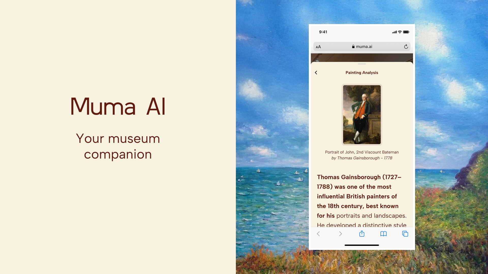

# 🎨 Muma AI - Your Personal Museum Companion

<div align="center">



### ElevenLabs Worldwide Hackathon Submission

**An AI companion designed to enhance museum visits by helping users understand and explore artworks with ease.**

[Live Demo](https://muma-sigma.vercel.app/) • [GitHub Repository](https://github.com/ai-muma/appmuma)

</div>

---

## 📹 Demo Video

https://github.com/user-attachments/assets/video.mp4

---

## 🎯 Problem Statement

Museum visitors often lack context or background information about the many paintings, sculptures, and art pieces they encounter, making it difficult to fully engage with each work. Traditional museum guides are:
- Limited by group sizes and schedules
- Unable to provide personalized, in-depth conversations
- Not accessible to everyone at all times

**Muma addresses this challenge** by allowing users to take a photo of an artwork, which is then analyzed by AI to provide clear, informative insights about the piece and its creator, enabling a more accessible and enriching cultural experience.

---

## 👥 Team

**Manuel** - AI Engineer/CTO at Desde Arriba  
Building FastAPI agentic systems

**Iñigo** - Web3 UX Designer at Puffer Finance  
Focused on liquid restaking

---

## ✨ Features

- **🔍 AI Vision Recognition**: Instantly identify artworks using OpenAI GPT-4 Vision API
- **🗣️ Natural Voice Conversations**: Engage in natural dialogue with ElevenLabs Conversational AI
- **📚 Rich Context**: Get detailed artwork information including history, technique, and fascinating facts
- **📸 Multiple Input Methods**: Upload files or capture images directly from your camera using Web Speech API
- **🎯 Real-time Analysis**: Receive immediate, accurate artwork identification
- **🌐 Accessible Anywhere**: Works with any artwork, no pre-built database required
- **🎤 Voice Commands**: Trigger photo capture using voice commands via Web Speech API

---

## 🏗️ Architecture

```
User → Voice Command / Image Upload → /api/analyze-artwork → OpenAI Vision API
                                                           ↓
                                              Build Context from Vision Results
                                                           ↓
                                          ElevenLabs Conversation Agent
                                                           ↓
                                          Natural Voice Interaction
```

---

## 🛠️ Tech Stack

### Frontend
- **Next.js 16** - React-based framework for production
- **React 19** - Modern UI library
- **TailwindCSS** - Utility-first CSS framework
- **TypeScript** - Type-safe development

### AI & APIs
- **OpenAI GPT-4o Vision API** - Artwork identification and analysis
- **ElevenLabs Conversational AI SDK** - Natural voice conversations
- **Web Speech API** - Voice command recognition for photo capture

### Development Tools
- **CodeRabbit** - AI-powered code review and development assistance
- **BlackBox** - Development tooling
- **Clerk** - User authentication (planned)

---

## 🚀 Getting Started

### Prerequisites

- Node.js 18.x or higher
- npm or yarn package manager
- OpenAI API key with GPT-4 Vision access
- ElevenLabs API key and Agent ID

### Installation

1. **Clone the repository**
```bash
git clone https://github.com/ai-muma/appmuma.git
cd appmuma
```

2. **Install dependencies**
```bash
npm install
```

3. **Configure environment variables**

Create a `.env.local` file in the root directory:

```bash
# OpenAI API Key for Vision API
OPENAI_API_KEY=your_openai_api_key_here

# ElevenLabs API Keys
ELEVENLABS_API_KEY=your_elevenlabs_api_key_here
NEXT_PUBLIC_AGENT_ID=your_elevenlabs_agent_id_here
```

4. **Get your API keys**

**OpenAI API Key:**
- Visit [OpenAI Platform](https://platform.openai.com/)
- Sign up or log in
- Navigate to API Keys section
- Create a new API key
- Copy and paste into `.env.local`

**ElevenLabs API Key & Agent ID:**
- Visit [ElevenLabs](https://elevenlabs.io/)
- Sign up or log in
- Navigate to your profile/API settings
- Copy your API key
- Create a conversational agent and copy the Agent ID
- Paste both into `.env.local`

5. **Run the development server**
```bash
npm run dev
```

6. **Open your browser**

Navigate to [http://localhost:3000](http://localhost:3000)

---

## 💡 How to Use Muma

1. **Capture an Artwork**
   - Click the camera button or use voice commands
   - Upload an image or take a photo directly
   - Ensure the artwork is clearly visible

2. **AI Analysis**
   - OpenAI Vision API identifies the artwork
   - System extracts detailed information
   - Context is prepared for conversation

3. **Start Conversation**
   - Click "Start Conversation" button
   - Allow microphone access in your browser
   - Begin speaking naturally with the AI

4. **Explore & Learn**
   - Ask about the artist's background
   - Inquire about historical context
   - Discuss artistic techniques
   - Learn interesting facts and stories

---

## 📁 Project Structure

```
muma/
├── app/
│   ├── api/
│   │   └── analyze-artwork/
│   │       └── route.ts              # Backend API endpoint for artwork analysis
│   ├── components/
│   │   ├── artwork-uploader.tsx      # Image upload/camera component
│   │   └── conversation.tsx          # ElevenLabs conversation component
│   ├── page.tsx                      # Main application page
│   ├── layout.tsx                    # App layout wrapper
│   └── globals.css                   # Global styles
├── lib/
│   ├── openai.ts                     # OpenAI client configuration
│   └── mock-artwork-data.ts          # Mock database for testing
├── public/                           # Static assets
├── .env.local                        # Environment variables (create this)
├── package.json                      # Project dependencies
└── tsconfig.json                     # TypeScript configuration
```

---

## 🔌 API Endpoints

### POST /api/analyze-artwork

Analyzes an uploaded artwork image using OpenAI Vision API.

**Request:**
```json
{
  "imageData": "data:image/jpeg;base64,..."
}
```

**Response:**
```json
{
  "success": true,
  "identified": true,
  "inDatabase": true,
  "identification": {
    "name": "The Starry Night",
    "artist": "Vincent van Gogh",
    "year": "1889",
    "medium": "Oil on canvas",
    "confidence": "high"
  },
  "artwork": {
    "id": "starry-night-1889",
    "name": "The Starry Night",
    "artist": "Vincent van Gogh",
    "year": "1889",
    "medium": "Oil on canvas",
    "description": "...",
    "conversationContext": "..."
  }
}
```

### GET /api/analyze-artwork

Health check endpoint to verify API availability.

---

## 🎨 Use Cases

- **Museum Visitors**: Get instant, personalized information about any artwork
- **Students**: Learn about art history through interactive conversations
- **Tourists**: Overcome language barriers with accessible art education
- **Art Enthusiasts**: Deepen understanding of techniques and historical context
- **Educators**: Use as a teaching tool for art appreciation

---

## 🌟 What Makes Muma Special

- **No Pre-built Database Required**: Works with any artwork in any museum
- **Natural Conversations**: Not just facts, but engaging dialogue about art
- **Accessible**: Voice-first interface makes art education available to everyone
- **Instant Recognition**: Fast, accurate artwork identification
- **Rich Context**: Goes beyond basic facts to provide meaningful insights

---

## 🔮 Future Enhancements

- [ ] Multi-language support for international museums
- [ ] User authentication and profile management
- [ ] Save favorite artworks and conversation history
- [ ] Offline mode for museums with limited connectivity
- [ ] AR overlay features for enhanced museum experience
- [ ] Integration with museum collection databases
- [ ] Social features to share discoveries with friends
- [ ] Artist comparison and art movement exploration
- [ ] Export conversation transcripts and notes
- [ ] Mobile app for iOS and Android

---

## 🐛 Troubleshooting

**"Missing OPENAI_API_KEY environment variable"**
- Ensure `.env.local` exists in the root directory
- Verify your OpenAI API key is correctly added
- Restart the development server after adding variables

**"Unable to access camera"**
- Grant camera permissions in your browser settings
- Ensure you're using HTTPS or localhost
- Check if another application is using the camera

**"NEXT_PUBLIC_AGENT_ID not configured"**
- Add your ElevenLabs Agent ID to `.env.local`
- Remember: the variable must start with `NEXT_PUBLIC_` for client-side access
- Restart the development server

**"Microphone not working"**
- Allow microphone access when prompted by the browser
- Check browser permissions in settings
- Ensure no other application is blocking microphone access

---

## 📝 License

MIT License - feel free to use this project for your own museum experiences!

---

## 🙏 Credits & Acknowledgments

Built with love for the **ElevenLabs Worldwide Hackathon**

### Technologies
- [Next.js](https://nextjs.org/) - The React Framework for the Web
- [OpenAI](https://openai.com/) - GPT-4 Vision API for artwork identification
- [ElevenLabs](https://elevenlabs.io/) - Conversational AI for natural voice interactions
- [TailwindCSS](https://tailwindcss.com/) - Utility-first CSS framework
- [Web Speech API](https://developer.mozilla.org/en-US/docs/Web/API/Web_Speech_API) - Voice command recognition

### Tools
- [CodeRabbit](https://coderabbit.ai/) - AI-powered code review and development assistance
- [BlackBox](https://www.blackbox.ai/) - Development tooling
- [Clerk](https://clerk.com/) - User authentication platform

### Team
Special thanks to our amazing team members who made this project possible!

---

## 📧 Contact

For questions, feedback, or collaboration opportunities:
- Email: mhernandezb96@gmail.com
- GitHub: [ai-muma/appmuma](https://github.com/ai-muma/appmuma)
- Live Demo: [muma-sigma.vercel.app](https://muma-sigma.vercel.app/)

---

<div align="center">

**Made with ❤️ for art lovers everywhere**

*Enhancing museum visits, one conversation at a time*

</div>
